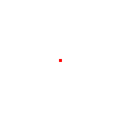

# Image assembly (WIP)
A simple & extensible assembly language for image generation

## Language features TODO
- mov, add/sub/mul/div
- general purpose registers
- sections and branches
- stack

## Image generation opcodes
- init [width: int], [height: int], [filename: string]
- fill [x: int], [y: int], [width: int], [height: int]
- save

## Example1


```asm
init 200, 200, "./image2.png"
fill 100, 100, 5, 5 ; pixel is 5by5
save
```
